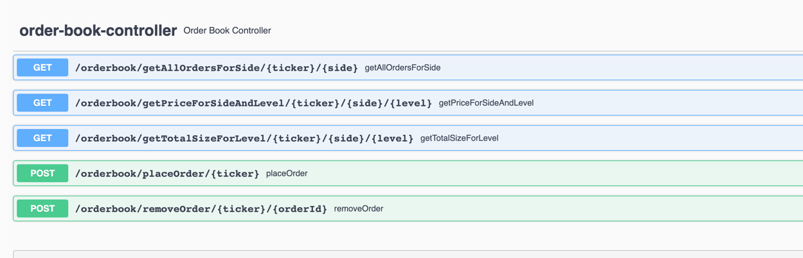

## Requirements

For building and running the application you need:

- [JDK 11](https://www.oracle.com/uk/java/technologies/javase/jdk11-archive-downloads.html)

## Running the application locally

There are several ways to run a Spring Boot application on your local machine. One way is to execute the `main` method in the `com.code.orderbook.OrderbookApplication` class from your IDE.

- You can download the source code from the following Github Link
- [Order Book Github](https://github.com/arshad2K8/OrderBook)
- Run following commands using a shell

```shell

cd orderbook
./mvnw install

- On Mac
./mvnw  spring-boot:run

- On Windows
./mvnw  spring-boot:run
```


## Verification
- [Swagger](http://localhost:8080/swagger-ui/#/order-book-controller)

Sample Request
1) POST /orderbook/placeOrder/{ticker}

ticker =IBM
```shell
{
  "orderId": 1,
  "price": 30,
  "side": "B",
  "size": 100
}
```

2) GET /orderbook/getAllOrdersForSide/{ticker}/{side}
   - ticker = IBM
   - side = B

```Sample Response
[
  {
    "orderId": 1,
    "price": 30,
    "side": "B",
    "size": 100
  }
]
```

3) You can see all the remaining endpoints 
